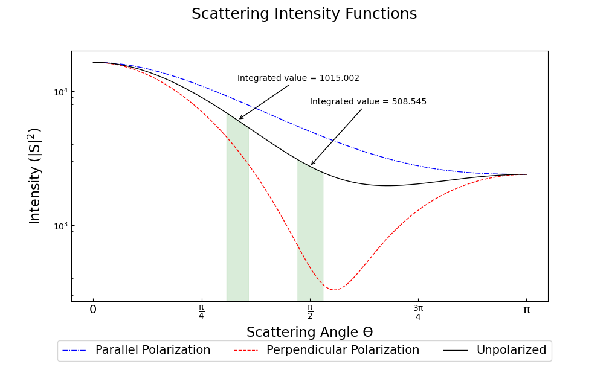

.. highlight:: python

General Usage tips and Example Scripts
======================================

PyMieScatt's functions are designed to work as a standalone calculator or as part of larger, more customized scripts. This page has a few selected examples which will expand as more innovative use cases appear. If you use PyMieScatt in your research in an unexpected or novel way, please `contact the author <mailto:bsumlin@wustl.edu>`_ to post an example here.

Mie Efficiencies of a Single Homogeneous Particle
-------------------------------------------------

To calculate the efficencies of a single homogeneous particle, use the :py:func:`MieQ` function.

.. code-block:: pycon
   
   >>> import PyMieScatt as ps
   >>> ps.MieQ(1.5+0.5j,532,200,asDict=True)
   {'Qabs': 1.2206932456722366,
    'Qback': 0.2557593071989655,
    'Qext': 1.6932375984850729,
    'Qpr': 1.5442174328606282,
    'Qratio': 0.5412387338385265,
    'Qsca': 0.47254435281283641,
    'g': 0.3153569918620277}

Mie Efficencies of a Weibull Distribution
-----------------------------------------

Consider the 405 nm Mie coefficients of 105 particles/cm\ :sup:`3`, with m = 1.5+0.5i, in a `Weibull distribution <https://en.wikipedia.org/wiki/Weibull_distribution>`_ with shape parameter sh = 5 and scale parameter sc = 200:

.. code-block:: pycon
   
   >>> import PyMieScatt as ps
   >>> import numpy as np
   >>> import matplotlib.pyplot as plt
   >>> dp = np.linspace(10,1000,1000)
   >>> N,sh,sc = 1e5,5,200
   >>> w=[N*((sh/sc)*(d/sc)**(sh-1))*np.exp(-(d/sc)**sh) for d in dp]
   >>> ps.Mie_withSizeDistribution(1.5+0.5j,405,dp,w,asDict=True)
   {'Babs': 3762.0479602613427,
    'Bback': 286.65698999981691,
    'Bext': 5747.4466502095638,
    'Bpr': 4662.181554274106,
    'Bratio': 550.87163111634698,
    'Bsca': 1985.3986899482211,
    'G': 0.54662325578736115}

Plotting Angular Functions
--------------------------

The `angular functions <http://pymiescatt.readthedocs.io/en/latest/forward.html#angular-functions>`_ return arrays that are suitable for plotting with `MatPlotLib <https://matplotlib.org/>`_. For example, plot the angular scattering functions of a 5 μm particle with m=1.7+0.5i, illuminated by 532 nm light. Note that the Mie calculations themselves only need two lines, the rest is making the plot look nice:

.. code-block:: python
   
   import PyMieScatt as ps
   import numpy as np
   import matplotlib.pyplot as plt
   
   m=1.7+0.5j
   w=532
   d=5000
   
   theta,SL,SR,SU = ps.ScatteringFunction(m,w,d)
   qR,SLQ,SRQ,SUQ = ps.qSpaceScatteringFunction(m,w,d,normed=False)
   
   plt.close('all')
   
   fig1 = plt.figure(figsize=(10,6))
   ax1 = fig1.add_subplot(1,2,1)
   ax2 = fig1.add_subplot(1,2,2)
   
   ax1.semilogy(theta,SL,'b',ls='dashdot',lw=1,label="Parallel Polarization")
   ax1.semilogy(theta,SR,'r',ls='dashed',lw=1,label="Perpendicular Polarization")
   ax1.semilogy(theta,SU,'k',lw=1,label="Unpolarized")
   
   x_label = ["0", r"$\mathregular{\frac{\pi}{4}}$", r"$\mathregular{\frac{\pi}{2}}$",r"$\mathregular{\frac{3\pi}{4}}$",r"$\mathregular{\pi}$"]
   x_tick = [0,np.pi/4,np.pi/2,3*np.pi/4,np.pi]
   ax1.set_xticks(x_tick)
   ax1.set_xticklabels(x_label,fontsize=14)
   ax1.tick_params(which='both',direction='in')
   ax1.set_xlabel("ϴ",fontsize=16)
   ax1.set_ylabel(r"Intensity ($\mathregular{|S|^2}$)",fontsize=16,labelpad=10)
   
   ax2.loglog(qR,SLQ,'b',ls='dashdot',lw=1,label="Parallel Polarization")
   ax2.loglog(qR,SRQ,'r',ls='dashed',lw=1,label="Perpendicular Polarization")
   ax2.loglog(qR,SUQ,'k',lw=1,label="Unpolarized")
   
   ax2.tick_params(which='both',direction='in')
   ax2.set_xlabel("qR",fontsize=14)
   handles, labels = ax1.get_legend_handles_labels()
   fig1.legend(handles,labels,fontsize=14,ncol=3,loc=8)
   
   fig1.suptitle("Scattering Intensity Functions",fontsize=18)
   fig1.show()
   plt.tight_layout(rect=[0.01,0.05,0.915,0.95])

This produces the following image:

.. image:: images/sif.png

We can do better, though! Suppose we wanted to, for educational purposes, demonstrate how the "Mie ripples" develop as we increase size parameter. This script considers a weakly absorbing particle of m=1.536+0.0015i. Its size parameter increases from 0.08 to 500 nm, the scattering function is plotted and a figure file is saved. The final few lines gather the figures into an mp4 video. Note that the Mie mathematics need only one line per loop, and the rest is generating images and movies.

First, install ffmpeg exe using conda:
.. code-block::

   $ conda install ffmpeg -c conda-forge
   

.. code-block:: python

   import PyMieScatt as ps
   import numpy as np
   import matplotlib.pyplot as plt
   import imageio
   import os
   
   wavelength=450.0
   m=1.536+0.0015j
   drange = np.logspace(1,np.log10(500*405/np.pi),250)
   for i,d in enumerate(drange):
     if 250%(i+1)==0:
       print("Working on image " + str(i) + "...",flush=True)
     theta,SL,SR,SU = ps.ScatteringFunction(m,wavelength,d,space='theta',normed=True)
       
     plt.close('all')
     
     fig1 = plt.figure(figsize=(10.08,6.08))
     ax1 = fig1.add_subplot(1,1,1)
     #ax2 = fig1.add_subplot(1,2,2)
     
     ax1.semilogy(theta,SL,'b',ls='dashdot',lw=1,label="Parallel Polarization")
     ax1.semilogy(theta,SR,'r',ls='dashed',lw=1,label="Perpendicular Polarization")
     ax1.semilogy(theta,SU,'k',lw=1,label="Unpolarized")
     
     x_label = ["0", r"$\mathregular{\frac{\pi}{4}}$", r"$\mathregular{\frac{\pi}{2}}$",r"$\mathregular{\frac{3\pi}{4}}$",r"$\mathregular{\pi}$"]
     x_tick = [0,np.pi/4,np.pi/2,3*np.pi/4,np.pi]
     ax1.set_xticks(x_tick)
     ax1.set_xticklabels(x_label,fontsize=14)
     ax1.tick_params(which='both',direction='in')
     ax1.set_xlabel("ϴ",fontsize=16)
     ax1.set_ylabel(r"Intensity ($\mathregular{|S|^2}$)",fontsize=16,labelpad=10)
     ax1.set_ylim([1e-9,1])
     ax1.set_xlim([1e-3,theta[-1]])
     ax1.annotate("x = πd/λ = {dd:1.2f}".format(dd=np.round(np.pi*d/405,2)), xy=(3, 1e-6),  xycoords='data',
               xytext=(0.05, 0.1), textcoords='axes fraction',
               horizontalalignment='left', verticalalignment='top',
               fontsize=18
               )
     handles, labels = ax1.get_legend_handles_labels()
     fig1.legend(handles,labels,fontsize=14,ncol=3,loc=8)
     
     fig1.suptitle("Scattering Intensity Functions",fontsize=18)
     fig1.show()
     plt.tight_layout(rect=[0.01,0.05,0.915,0.95])
   
     plt.savefig('output\\' + str(i).rjust(3,'0') + '.png')
   
   filenames = os.listdir('output\\')
   dur = [0.1 for x in range(250)]
   dur[249]=10
   with imageio.get_writer('mie_ripples.mp4', mode='I', fps=10) as writer:
       for filename in filenames:
           image = imageio.imread('output\\' + filename)
           writer.append_data(image)

		   
This produces a nice video, which I'll embed here just as soon as ReadTheDocs supports Github content embedding. For now, you can download it `here <https://github.com/bsumlin/PyMieScatt/blob/master/docs/images/mie_ripples.mp4?raw=true>`_.

.. raw:: html 

	<video width="320" height="240" controls>
	  <source src="mir_ripples.mp4" type="video/mp4">
	Your browser does not support the video tag.
	</video>

Angular Scattering Function of Salt Aerosol
-------------------------------------------

Recently, a colleague needed to know how much light a distribution of salt aerosol would scatter into two detectors, one at 60° and one at 90°. We modeled a lognormal distribution of NaCl particles based on laboratory measurements and then tried to figure out how much light we'd see at various angles.

.. code-block:: python

   import PyMieScatt as ps # import PyMieScatt and abbreviate as ps
   import matplotlib.pyplot as plt # import standard plotting library and abbreviate as plt
   import numpy as np # import numpy and abbreviate as np
   from scipy.integrate import trapz # import a single function for integration using trapezoidal rule
   
   m = 1.536 # refractive index of NaCl
   wavelength = 405 # replace with the laser wavelength (nm)
   
   dp_g = 85 # geometric mean diameter - replace with your own (nm)
   sigma_g = 1.5 # geometric standard deviation - replace with your own (unitless)
   N = 1e5 # total number of particles - replace with your own (cm^-3)
   
   B = ps.Mie_Lognormal(m,wavelength,sigma_g,dp_g,N,returnDistribution=True) # Calculate optical properties
   
   S = ps.SF_withSizeDistribution(m,wavelength,B[7],B[8])
   
   #%% Make graphs - lots of this is really unnecessary decoration for a pretty graph.
   plt.close('all')
   
   fig1 = plt.figure(figsize=(10.08,6.08))
   ax1 = fig1.add_subplot(1,1,1)
   
   ax1.plot(S[0],S[1],'b',ls='dashdot',lw=1,label="Parallel Polarization")
   ax1.plot(S[0],S[2],'r',ls='dashed',lw=1,label="Perpendicular Polarization")
   ax1.plot(S[0],S[3],'k',lw=1,label="Unpolarized")
   
   x_label = ["0", r"$\mathregular{\frac{\pi}{4}}$", r"$\mathregular{\frac{\pi}{2}}$",r"$\mathregular{\frac{3\pi}{4}}$",r"$\mathregular{\pi}$"]
   x_tick = [0,np.pi/4,np.pi/2,3*np.pi/4,np.pi]
   ax1.set_xticks(x_tick)
   ax1.set_xticklabels(x_label,fontsize=14)
   ax1.tick_params(which='both',direction='in')
   ax1.set_xlabel("Scattering Angle ϴ",fontsize=16)
   ax1.set_ylabel(r"Intensity ($\mathregular{|S|^2}$)",fontsize=16,labelpad=10)
   handles, labels = ax1.get_legend_handles_labels()
   fig1.legend(handles,labels,fontsize=14,ncol=3,loc=8)
   
   fig1.suptitle("Scattering Intensity Functions",fontsize=18)
   fig1.show()
   plt.tight_layout(rect=[0.01,0.05,0.915,0.95])
   
   # Highlight certain angles and compute integral
   sixty = [0.96<x<1.13 for x in S[0]]
   ninety = [1.48<x<1.67 for x in S[0]]
   ax1.fill_between(S[0],0,S[3],where=sixty,color='g',alpha=0.15)
   ax1.fill_between(S[0],0,S[3],where=ninety,color='g',alpha=0.15)
   ax1.set_yscale('log')
   
   int_sixty = trapz(S[3][110:130],S[0][110:130])
   int_ninety = trapz(S[3][169:191],S[0][169:191])
   
   # Annotate plot with integral results
   ax1.annotate("Integrated value = {i:1.3f}".format(i=int_sixty),
               xy=(np.pi/3, S[3][120]), xycoords='data',
               xytext=(np.pi/6, 0.8), textcoords='data',
               arrowprops=dict(arrowstyle="->",
                               connectionstyle="arc3"),
               )
   ax1.annotate("Integrated value = {i:1.3f}".format(i=int_ninety),
               xy=(np.pi/2, S[3][180]), xycoords='data',
               xytext=(2*np.pi/5, 2), textcoords='data',
               arrowprops=dict(arrowstyle="->",
                               connectionstyle="arc3"),
               )

Modeling Behavior of a Self-Preserving Distribution
----------------------------------------------------

This code example will (after several hours on a typical PC) produce a ten-second video of the scattering and absorption behavior of a δ-distribution of 300 nm particles, which can be considered the limiting case of a lognormal distribution where the geometric standard deviation σ\ :sub:`g` equals 1. Atmospheric aerosol distributions are typically modeled as lognormal distributions with σ\ :sub:`g` around 1.7, and here we animate from 1 to 2. The animation also includes the solution for the refractive index given some assumed optical measurements (that is, scattering and absorption measurements when m=1.60+0.36j and λ = 405 nm).

There is a commented block on lines 37-39 that can be uncommented to produce a single image with random σ\ :sub:`g` between 1 and 2. The revelent PyMieScatt calculations are on lines 45 and 136. That's it! The rest is preparing inputs and making pretty graphs.

I'm still working on optimizing a few things. For now, it takes about 15 minutes to make each frame on my computer. At 50 frames, that's about 12.5 hours.

.. code-block:: python

   import PyMieScatt as ps
   import matplotlib.pyplot as plt
   import numpy as np
   from time import time
   import matplotlib.colors as colors
   from mpl_toolkits.mplot3d import Axes3D
   from matplotlib import cm
   from scipy.ndimage import zoom
   import imageio
   import os
   
   def truncate_colormap(cmap, minval=0.0, maxval=1.0, n=100):
     new_cmap = colors.LinearSegmentedColormap.from_list('trunc({n},{a:.2f},{b:.2f})'.format(n=cmap.name, a=minval, b=maxval),cmap(np.linspace(minval, maxval, n)))
     return new_cmap
   
   N = 1e6
   w = 405
   maxDiameter = 3500
   numDiams = 1200
   
   ithPart = lambda gammai, dp, dpgi, sigmagi: (gammai/(np.sqrt(2*np.pi)*np.log(sigmagi)*dp))*np.exp(-(np.log(dp)-np.log(dpgi))**2/(2*np.log(sigmagi)**2))
   dp = np.logspace(np.log10(1), np.log10(maxDiameter), numDiams)
   
   sigmaList = np.logspace(np.log10(1.005), np.log10(2), 49)
   
   mu=300
   
   ndp = [N*ithPart(1,dp,mu,s) for s in sigmaList]
   
   deltaD = np.zeros(numDiams)
   deltaD[838]=N
   
   lognormalList = [deltaD] + ndp
   sigmaList = np.insert(sigmaList,0,1)
   
   ## Test region - uncomment for a single graph
   #testCase = np.random.randint(1,49)
   #lognormalList = [lognormalList[testCase]]
   #sigmaList = [sigmaList[testCase]]
   
   BscaSolution = []
   BabsSolution = []
   
   for l in lognormalList:
     _,_s,_a,*rest = ps.Mie_SD(1.6+0.36j,w,dp,l)
     BscaSolution.append(_s)
     BabsSolution.append(_a)
   
   nMin=1.3
   nMax=3
   kMin=0
   kMax=2
   
   points = 40
   interpolationFactor = 2
   
   nRange = np.linspace(nMin,nMax,points)
   kRange = np.linspace(kMin,kMax,points)
   
   plt.close('all')
   
   for i,(sigma,l,ssol,asol) in enumerate(zip(sigmaList,lognormalList,BscaSolution,BabsSolution)):
     start = time()
     BscaList = []
     BabsList = []
     nList = []
     kList = []
     for n in nRange:
       s = []
       a = []
       for k in kRange:
         m = n+k*1.0j
         _,Bsca,Babs,*rest = ps.Mie_SD(m,w,dp,l)
         s.append(Bsca)
         a.append(Babs)
       BscaList.append(s)
       BabsList.append(a)
     n = zoom(nRange,interpolationFactor)
     k = zoom(kRange,interpolationFactor)
     BscaSurf = zoom(np.transpose(np.array(BscaList)),interpolationFactor)
     BabsSurf = zoom(np.transpose(np.array(BabsList)),interpolationFactor)
     nSurf,kSurf=np.meshgrid(n,k)
     
     c1 = truncate_colormap(cm.Reds,0.2,1,n=256)
     c2 = truncate_colormap(cm.Blues,0.2,1,n=256)
     
     xMin,xMax = nMin,nMax
     yMin,yMax = kMin,kMax
   
     plt.close('all')
     fig1 = plt.figure(figsize=(10.08,8))
     
     plt.suptitle("σ={ww:1.3f}".format(ww=sigma),fontsize=24)
     
     ax1 = plt.subplot2grid((3,4),(0,0), projection='3d', rowspan=2, colspan=2)
     ax2 = plt.subplot2grid((3,4),(0,2), projection='3d', rowspan=2, colspan=2)
     ax3 = plt.subplot2grid((3,4),(2,0), colspan=3)
     ax4 = plt.subplot2grid((3,4),(2,3))
     
     ax1.plot_surface(nSurf,kSurf,BscaSurf,rstride=1,cstride=1,cmap=c1,alpha=0.5)
     ax1.contour(nSurf,kSurf,BscaSurf,[ssol],lw=2,colors='r',linestyles='dashdot')
     ax1.contour(nSurf,kSurf,BscaSurf,[ssol],colors='r',linestyles='dashdot',offset=0)
     
     ax2.plot_surface(nSurf,kSurf,BabsSurf,rstride=1,cstride=1,cmap=c2,alpha=0.5,zorder=-1)
     ax2.contour(nSurf,kSurf,BabsSurf,[asol],lw=2,colors='b',linestyles='solid',zorder=3)
     ax2.contour(nSurf,kSurf,BabsSurf,[asol],colors='b',linestyles='solid',offset=0)
     
     boxLabels = ["βsca","βabs"]
   
     yticks = [2,1.5,1,0.5,0]
     xticks = [3,2.5,2,1.5]
   
     for a,t in zip([ax1,ax2],boxLabels):
       lims = a.get_zlim3d()
       a.set_zlim3d(0,lims[1])
       a.text(1.5,0,(a.get_zlim3d()[1])*1.15,t,ha="center",va="center",size=18,zorder=5)
       a.set_ylim(2,0)
       a.set_xlim(3,1.3)
       a.set_xticks(xticks)
       a.set_xticklabels(xticks,rotation=-15,va='center',ha='left')
       a.set_yticks(yticks)
       a.set_yticklabels(yticks,rotation=-15,va='center',ha='left')
       a.set_zticklabels([])
       a.view_init(20,120)
       a.tick_params(axis='both', which='major', labelsize=12,pad=0)
       a.tick_params(axis='y',pad=-2)
       a.set_xlabel("n",fontsize=18,labelpad=2)
       a.set_ylabel("k",fontsize=18,labelpad=3)
   
     ax3.semilogx(dp,l,c='g')
     ax3.set_xlabel('Diameter',fontsize=16)
     ax3.get_yaxis().set_ticks([])
     ax3.tick_params(which='both',direction='in')
     ax3.grid(color='#dddddd')
     
     giv = ps.GraphicalInversion_SD(ssol,asol,w,dp,l,gridPoints=points*1.5,kMin=0.001,kMax=2,annotation=False,axisOption=10,fig=fig1,ax=ax4)
     ax4.set_xlim(1.3,3)
     ax4.yaxis.tick_right()
     ax4.yaxis.set_label_position("right")
     ax4.legend_.remove()
     ax4.set_title("")
     ax4.set_yscale('linear')
     
     plt.tight_layout()
   
     plt.savefig("Distro/{num:02d}_distro.png".format(num=i))
     
     end = time()
     print("Frame {n:1d}/30 done in {t:1.2f} seconds.".format(n=i+1,t=end-start))
   
   filenames = os.listdir('Distro\\')
   with imageio.get_writer('SD.mp4', mode='I', fps=5) as writer:
     for filename in filenames:
       image = imageio.imread('Distro\\' + filename)
       writer.append_data(image)

Once readthedocs allows embedded .mp4s, the animation will be posted here. I should probably just make a youtube account.