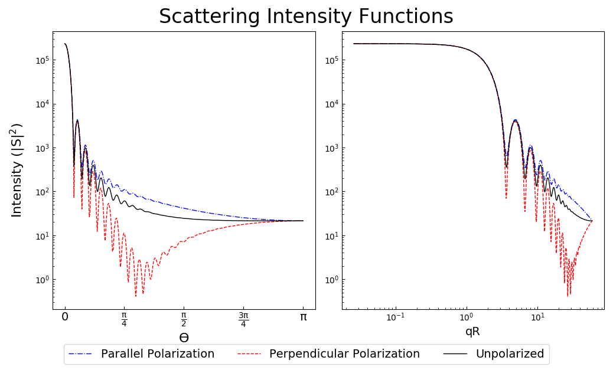

.. highlight:: python

General Usage tips and Example Scripts
======================================

Mie Efficiencies of a Single Homogeneous Particle
-------------------------------------------------

To calculate the efficencies of a single homogeneous particle, use the :py:func:`MieQ` function. ::

.. code-block:: pycon
   
   >>> import PyMieScatt as ps
   >>> ps.MieQ(1.5+0.5j,532,200,asDict=True)
   {'Qabs': 1.2206932456722366,
    'Qback': 0.2557593071989655,
    'Qext': 1.6932375984850729,
    'Qpr': 1.5442174328606282,
    'Qratio': 0.5412387338385265,
    'Qsca': 0.47254435281283641,
    'g': 0.3153569918620277}

Mie Efficencies of a Weibull Distribution
-----------------------------------------

Consider the 405 nm Mie coefficients of 105 particles/cm\ :sup:`3`, with m = 1.5+0.5i, in a `Weibull distribution <https://en.wikipedia.org/wiki/Weibull_distribution>`_ with shape parameter sh = 5 and scale parameter sc = 200: ::

.. code-block:: pycon
   
   >>> import PyMieScatt as ps
   >>> import numpy as np
   >>> import matplotlib.pyplot as plt
   >>> dp = np.linspace(10,1000,1000)
   >>> N,sh,sc = 1e5,5,200
   >>> w=[N*((sh/sc)*(d/sc)**(sh-1))*np.exp(-(d/sc)**sh) for d in dp]
   >>> ps.Mie_withSizeDistribution(1.5+0.5j,405,dp,w,asDict=True)
   {'Babs': 3762.0479602613427,
    'Bback': 286.65698999981691,
    'Bext': 5747.4466502095638,
    'Bpr': 4662.181554274106,
    'Bratio': 550.87163111634698,
    'Bsca': 1985.3986899482211,
    'G': 0.54662325578736115}

Plotting Angular Functions
--------------------------

The `angular functions <http://pymiescatt.readthedocs.io/en/latest/forward.html#angular-functions>`_ return arrays that are suitable for plotting with `MatPlotLib <https://matplotlib.org/>`_. For example, plot the angular scattering functions of a 5 μm particle with m=1.7+0.5i, illuminated by 532 nm light:

.. code-block:: python
   :linenos:
   
   import PyMieScatt as ps
   import numpy as np
   import matplotlib.pyplot as plt
   
   m=1.7+0.5j
   w=532
   d=5000
   
   theta,SL,SR,SU = ps.ScatteringFunction(m,w,d)
   qR,SLQ,SRQ,SUQ = ps.qSpaceScatteringFunction(m,w,d,normed=False)
   
   plt.close('all')
   
   fig1 = plt.figure(figsize=(10,6))
   ax1 = fig1.add_subplot(1,2,1)
   ax2 = fig1.add_subplot(1,2,2)
   
   ax1.semilogy(theta,SL,'b',ls='dashdot',lw=1,label="Parallel Polarization")
   ax1.semilogy(theta,SR,'r',ls='dashed',lw=1,label="Perpendicular Polarization")
   ax1.semilogy(theta,SU,'k',lw=1,label="Unpolarized")
   
   x_label = ["0", r"$\mathregular{\frac{\pi}{4}}$", r"$\mathregular{\frac{\pi}{2}}$",r"$\mathregular{\frac{3\pi}{4}}$",r"$\mathregular{\pi}$"]
   x_tick = [0,np.pi/4,np.pi/2,3*np.pi/4,np.pi]
   ax1.set_xticks(x_tick)
   ax1.set_xticklabels(x_label,fontsize=14)
   ax1.tick_params(which='both',direction='in')
   ax1.set_xlabel("ϴ",fontsize=16)
   ax1.set_ylabel(r"Intensity ($\mathregular{|S|^2}$)",fontsize=16,labelpad=10)
   
   ax2.loglog(qR,SLQ,'b',ls='dashdot',lw=1,label="Parallel Polarization")
   ax2.loglog(qR,SRQ,'r',ls='dashed',lw=1,label="Perpendicular Polarization")
   ax2.loglog(qR,SUQ,'k',lw=1,label="Unpolarized")
   
   ax2.tick_params(which='both',direction='in')
   ax2.set_xlabel("qR",fontsize=14)
   handles, labels = ax1.get_legend_handles_labels()
   fig1.legend(handles,labels,fontsize=14,ncol=3,loc=8)
   
   fig1.suptitle("Scattering Intensity Functions",fontsize=18)
   fig1.show()
   plt.tight_layout(rect=[0.01,0.05,0.915,0.95])

This produces the following image:

