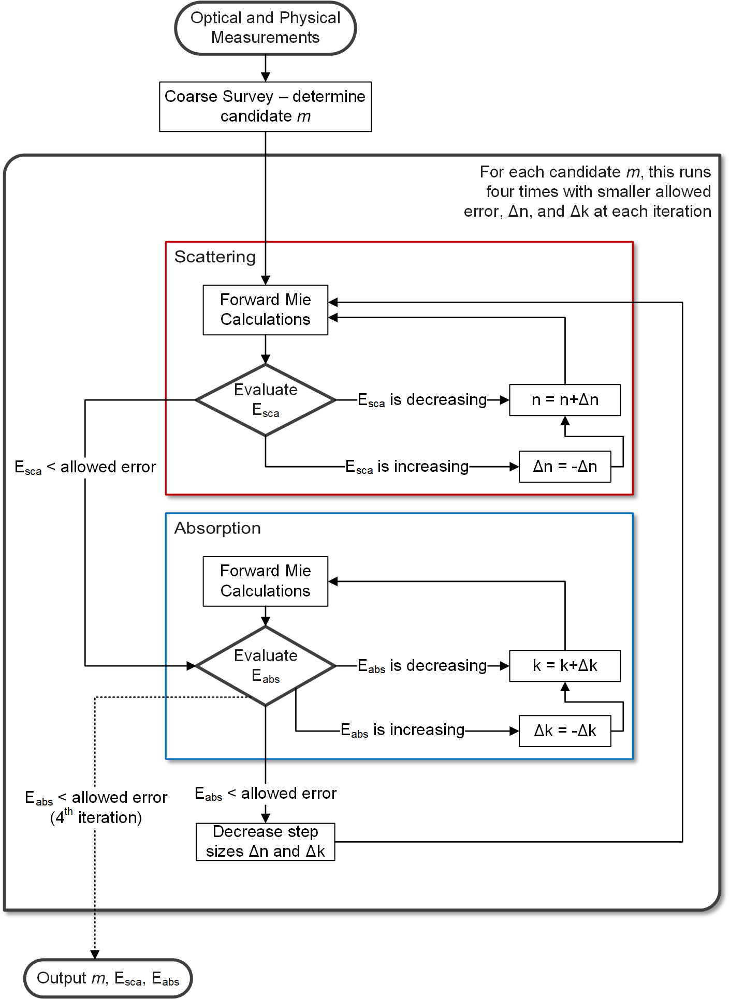

Inverse Mie Theory Functions
============================

Contour Intersection Inversion Functions
----------------------------------------

For more details on the contour intersection inversion method, please see Sumlin BJ, Heinson WR, Chakrabarty RK. *Retrieving the Aerosol Complex Refractive Index using PyMieScatt: A Mie Computational Package with Visualization Capabilities*. J. Quant. Spectros. Rad. Trans. 2017. DOI: `10.1016/j.jqsrt.2017.10.012 <https://doi.org/10.1016/j.jqsrt.2017.10.012>`_ There's also a good example `here <http://pymiescatt.readthedocs.io/en/latest/examples.html#visualization-of-the-contour-intersection-inversion-method>`_.

.. py:function:: ContourIntersection(Qsca, Qabs, wavelength, diameter[, nMin=1, nMax=3, kMin=0.00001, kMax=1, Qback=None, gridPoints=100, interpolationFactor=2, maxError=0.005, fig=None, ax=None, axisOption=0])

   Computes complex *m = n+ik* from a particle diameter (in nm), incident wavelength (in nm), and scattering and absorption efficiencies. Optionally, backscatter efficiency may be specified to constrain the problem to produce a unique solution.
   
   **Parameters**
   
   
   Qsca : float or list-like
	The scattering efficiency, or optionally, a list, tuple, or numpy.ndarray of scattering efficiency and its associated error.
   Qabs : float or list-like
	The absorption efficiency, or optionally, a list, tuple, or numpy.ndarray of absorption efficiency and its associated error..
   wavelength : float
	The wavelength of incident light, in nm.
   diameter : float
	The diameter of the particle, in nm.
   nMin : float, optional
	The minimum value of *n* to search.
   nMax : float, optional
	The maximum value of *n* to search.
   kMin : float, optional
	The minimum value of *k* to search.
   kMax : float, optional
	The maximum value of *k* to search.
   Qback : float or list-like, optional
	The backscatter efficiency, or optionally, a list, tuple, or numpy.ndarray of backscatter efficiency and its associated error.
   gridPoints : int, optional
	The number of gridpoints for the search mesh. Defaults to 200. Increase for better resolution but longer run times.
   interpolationFactor : int, optional
	The interpolation to apply to the search fields, artificially increasing their resolutions. This is applied after calculations, so some features may be lost if **interpolationFactor** is too high and **gridPoints** is too low.
   maxError : float, optional
	The allowed error in forward calculations of the retrived *m*.
   fig : matplotlib.figure object, optional (but recommended)
	The figure object to send to the geometric inversion routine. If unspecified, one will be created.
   ax : matplotlib.axes object, optional (but recommended)
	The axes object to send to the geometric inversion routine. If unspecified, one will be created.
   axisOption : int, optional
	Dictates the axis scales. Kind of useless since version 1.3.0. It's still around until I get rid of it. Acceptable parameters are:
	
	- '0' for automatic detection of best axis scaling
	- '1' for linear axes
	- '2' for linear x and logarithmic y
	- '3' for logarithmic x and linear y
	- '4' for log-log

   **Returns**
   
   
   solutionSet : list
	A list of all valid solutions
   ForwardCalculations : list
	A list of scattering and absorption efficencies produced by forward Mie calculations using the derived refractive indices
   solutionErrors : list
	The relative errors of the efficencies in **ForwardCalculations**.
   fig : matplotlib.figure object
	The figure object now associated with the inversion calculations.
   ax : matplotlib.axes object
	The axes object now associated with the inversion calculations.
   graphElements : dict
	A dict of all artists necessary to fully manipulate the appearance of the output. The keys will depend on the options passed to the inversion function itself (i.e., errors specified, backscatter specified). Maximally, it will contain:
	
	- 'Qsca', 'Qabs', 'Qback' - the major contours;
	- 'QscaErrFill', 'QscaErrOutline1', 'QscaErrOutline2' - the error bound contours;
	- 'QabsErrFill', 'QabsErrOutline1', 'QabsErrOutline2' - the error bound fills;
	- 'SolMark', 'SolFill' - the circle thingies at each solution;
	- 'CrosshairsH', 'CrosshairsV' - solution crosshairs;
	- 'LeftSpine', 'RightSpine', 'BottomSpine', 'TopSpine' - graph spines;
	- 'XAxis', 'YAxis' - the individual matplotlib axis objects.

.. py:function:: ContourIntersection_SD(Bsca, Babs, wavelength, dp, ndp[, nMin=1, nMax=3, kMin=0.00001, kMax=1, Bback=None, gridPoints=100, interpolationFactor=2, maxError=0.005, fig=None, ax=None, axisOption=0])

   Computes effective complex *m = n+ik* from a measured or constructed size distribution (in cm\ :sup:`-3`), incident wavelength (in nm), and scattering and absorption coefficients (in Mm\ :sup:`-1`). Optionally, backscatter coefficient may be specified to constrain the problem to produce a unique solution.
   
   **Parameters**
   
   
   Bsca : float or list-like
	The scattering coefficient, or optionally, a list, tuple, or numpy.ndarray of scattering coefficient and its associated error.
   Babs : float or list-like
	The absorption coefficient, or optionally, a list, tuple, or numpy.ndarray of absorption coefficient and its associated error..
   wavelength : float
	The wavelength of incident light, in nm.
   dp : list-like
	The diameter bins of the size distribution, in nm.
   ndp : list-like
	The number of particles per diameter bin corresponding to **dp**, in cm\ :sup:`-3`. Must be same length as **dp**.
   nMin : float, optional
	The minimum value of *n* to search.
   nMax : float, optional
	The maximum value of *n* to search.
   kMin : float, optional
	The minimum value of *k* to search.
   kMax : float, optional
	The maximum value of *k* to search.
   Bback : float or list-like, optional
	The backscatter coefficient, or optionally, a list, tuple, or numpy.ndarray of backscatter coefficient and its associated error.
   gridPoints : int, optional
	The number of gridpoints for the search mesh. Defaults to 200. Increase for better resolution but longer run times.
   interpolationFactor : int, optional
	The interpolation to apply to the search fields, artificially increasing their resolutions. This is applied after calculations, so some features may be lost if **interpolationFactor** is too high and **gridPoints** is too low.
   maxError : float, optional
	The allowed error in forward calculations of the retrived *m*.
   fig : matplotlib.figure object, optional (but recommended)
	The figure object to send to the geometric inversion routine. If unspecified, one will be created.
   ax : matplotlib.axes object, optional (but recommended)
	The axes object to send to the geometric inversion routine. If unspecified, one will be created.
   axisOption : int, optional
	Dictates the axis scales. Kind of useless since version 1.3.0. It's still around until I get rid of it. Acceptable parameters are:
	
	- '0' for automatic detection of best axis scaling
	- '1' for linear axes
	- '2' for linear x and logarithmic y
	- '3' for logarithmic x and linear y
	- '4' for log-log

   **Returns**
   
   
   solutionSet : list
	A list of all valid solutions
   ForwardCalculations : list
	A list of scattering and absorption coefficients produced by forward Mie calculations using the derived effective refractive indices
   solutionErrors : list
	The relative errors of the coefficients in **ForwardCalculations**.
   fig : matplotlib.figure object
	The figure object now associated with the inversion calculations.
   ax : matplotlib.axes object
	The axes object now associated with the inversion calculations.
   graphElements : dict
	A dict of all artists necessary to fully manipulate the appearance of the output. The keys will depend on the options passed to the inversion function itself (i.e., errors specified, backscatter specified). Maximally, it will contain:
	
	- 'Bsca', 'Babs', 'Bback' - the major contours;
	- 'BscaErrFill', 'BscaErrOutline1', 'BscaErrOutline2' - the error bound contours;
	- 'BabsErrFill', 'BabsErrOutline1', 'BabsErrOutline2' - the error bound fills;
	- 'SolMark', 'SolFill' - the circle thingies at each solution;
	- 'CrosshairsH', 'CrosshairsV' - solution crosshairs;
	- 'LeftSpine', 'RightSpine', 'BottomSpine', 'TopSpine' - graph spines;
	- 'XAxis', 'YAxis' - the individual matplotlib axis objects.

Survey-iteration Inversion Functions
------------------------------------

The survey-iteration inversion algorithm is discussed in detail in the Supplementary Material of the JQSRT paper. It is a strictly numerical two phase algorithm. First, a low-resolution survey of *n-k* space is conducted and values of efficiencies or coefficients close to the inputs are located. From this survey, candidate *m* values are determined. The iteration phase is best described by this flowchart:

.. py:function:: SurveyIteration(Qsca, Qabs, wavelength, diameter[, tolerance=0.0005])

   Computes complex *m=n+ik* for given scattering and absorption efficencies, incident wavelength, and particle diameter.
   
   **Parameters**
   
   
   Qsca : float
	Measured scattering efficiency.
   Qabs : float
	Measured absorption efficiency.
   wavelength : float
	The incident wavelength of light, in nm.
   diameter : float
	The particle diameter in nm.
   tolerance : float, optional
	The maximum error allowed in forward Mie calculations of retrieved indices.
	
   **Returns**

   resultM : list-like
	The retrieved refractive indices. Be sure and scrutinize this list for repeat entries.
   resultScaErr : list-like
	The relative error in scattering efficiency for each retrieved *m*.
   resultAbsErr : list-like
	The relative error in absorption efficiency for each retrieved *m*.

.. py:function:: SurveyIteration_SD(Bsca, Babs, wavelength, dp, ndp[, tolerance=0.0005])

   Computes complex *m=n+ik* for given scattering and absorption coefficients, incident wavelength, and particle diameter.
   
   **Parameters**
   
   
   Qsca : float
	Measured scattering coefficient.
   Qabs : float
	Measured absorption coefficient.
   wavelength : float
	The incident wavelength of light, in nm.
   dp : list-like
	The particle diameter bins in nm.
   ndp : list-like
	The particle concentrations (in cm\ :sup:`-3`) corresponding to each of the bins in **dp**.
   tolerance : float, optional
	The maximum error allowed in forward Mie calculations of retrieved indices.
	
   **Returns**

   resultM : list-like
	The retrieved refractive indices. Be sure and scrutinize this list for repeat entries.
   resultScaErr : list-like
	The relative error in scattering coefficient for each retrieved *m*.
   resultAbsErr : list-like
	The relative error in absorption coefficient for each retrieved *m*.